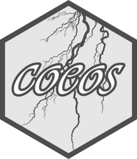
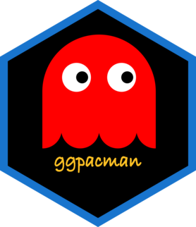
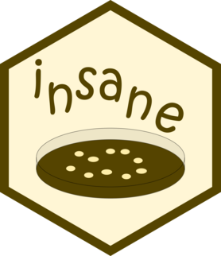
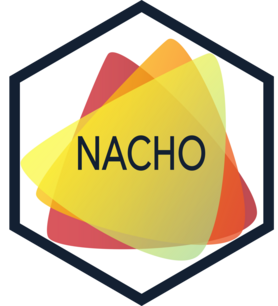
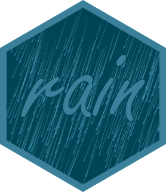
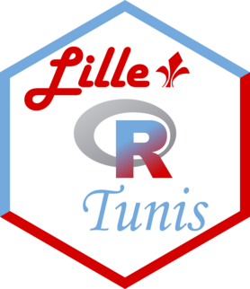
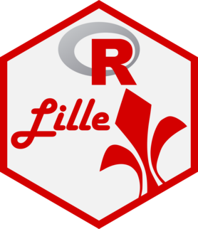

<!-- README.md is generated from README.Rmd. Please edit that file -->

# hex-stickers 

<!-- badges: start -->

<!-- badges: end -->

<table>
<tr>
<td align="center">
 <a href="PNG/carot.png">carot.png</a> <a href="SVG/carot.svg">carot.svg</a>
</td>
<td align="center">
 <a href="PNG/coeos.png">coeos.png</a> <a href="SVG/coeos.svg">coeos.svg</a>
</td>
<td align="center">
 <a href="PNG/ggpacman.png">ggpacman.png</a> <a href="SVG/ggpacman.svg">ggpacman.svg</a>
</td>
<td align="center">
 <a href="PNG/globalr.png">globalr.png</a> <a href="SVG/globalr.svg">globalr.svg</a>
</td>
<td align="center">
 <a href="PNG/insane.png">insane.png</a> <a href="SVG/insane.svg">insane.svg</a>
</td>
</tr>
<tr>
<td align="center">
 <a href="PNG/mc.png">mc.png</a> <a href="SVG/mc.svg">mc.svg</a>
</td>
<td align="center">
 <a href="PNG/mcsb.png">mcsb.png</a> <a href="SVG/mcsb.svg">mcsb.svg</a>
</td>
<td align="center">
 <a href="PNG/mistr.png">mistr.png</a> <a href="SVG/mistr.svg">mistr.svg</a>
</td>
<td align="center">
 <a href="PNG/nacho.png">nacho.png</a> <a href="SVG/nacho.svg">nacho.svg</a>
</td>
<td align="center">
 <a href="PNG/rain.png">rain.png</a> <a href="SVG/rain.svg">rain.svg</a>
</td>
</tr>
<tr>
<td align="center">
 <a href="PNG/rlille_tunis.png">rlille_tunis.png</a> <a href="SVG/rlille_tunis.svg">rlille_tunis.svg</a>
</td>
<td align="center">
 <a href="PNG/rlille.png">rlille.png</a> <a href="SVG/rlille.svg">rlille.svg</a>
</td>
<td align="center">
 <a href="PNG/rocketchatr.png">rocketchatr.png</a> <a href="SVG/rocketchatr.svg">rocketchatr.svg</a>
</td>
<td align="center">
 <a href="PNG/umr1283_8199.png">umr1283_8199.png</a> <a href="SVG/umr1283_8199.svg">umr1283_8199.svg</a>
</td>
</tr>
</table>

All stickers are under with [CC0](LICENSE.md).
